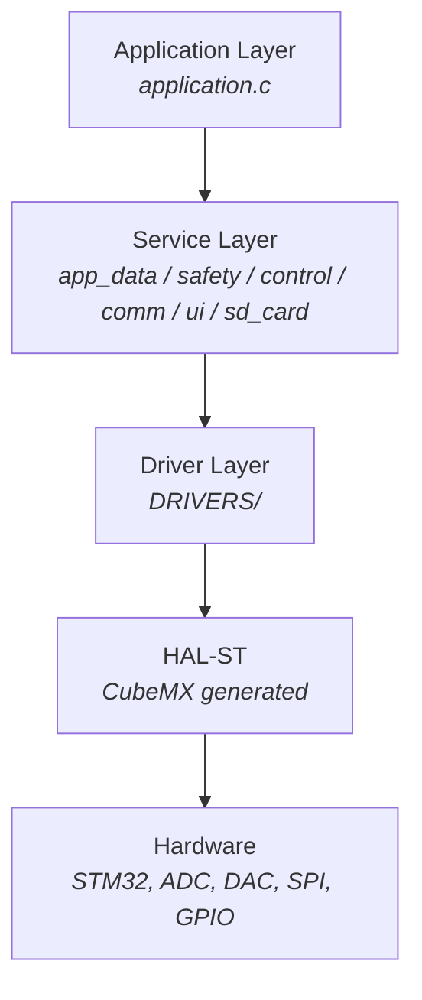
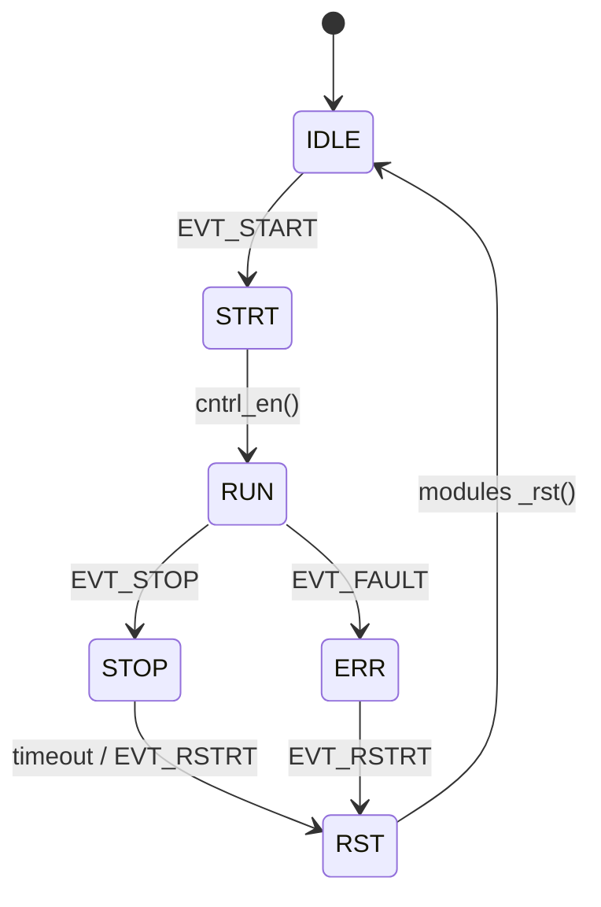
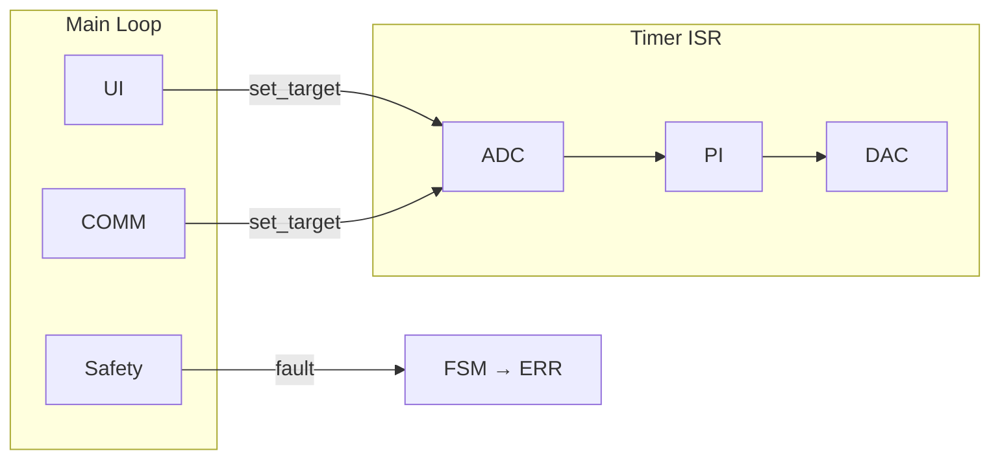

# Application Layer

---

1. Overview
2. Architecture
3. State Machine
4. State Transition Table
5. Modules
6. Data Flow
7. Module Interface Contract
8. Directory Structure

---

## 1. Overview

This is the implementation of __active-load__ logic.
Event-driven FSM that coordinates service modules (_control, safety, comm, ui, sd_card_)
Called from main.c via app_init() and app_runtime() in the main loop

## 2. Architecture



## 3. State Machine



## 4. State Transition Table

| State | Event | Action | New State |
| :-- | :--- | :--- | :--- |
| IDLE | EVT_START | --- | STRT |
| STRT | _unconditional_ | `cntrl_en()` | RUN |
| RUN | EVT_STOP | `cntrl_dis()` | STOP |
| RUN | EVT_FAULT | `cntrl_dis()` | ERR |
| STOP | timeout 30s | --- | RST |
| STOP | EVT_RSTRT | --- | RST |
| RST | _unconditional_ | `_rst()` modules | IDLE |
| ERR | EVT_RSTRT | --- | RST |

## 5. Modules

| Module | Responsibility | Context |
| :--- | :--- | :--- |
| app_data | singletonn register for important variables | --- |
| safety | fault detection, limit monitoring | main loop + `app_runtime()` guard |
| control | PI control loop (ADC &rarr; PI &rarr; DAC) | `TIM` ISR |
| comm | PC communication, data exchange | main loop |
| ui | LCD data display, encoder, buttons | main loop | 
| sd_card | data logging | main loop |

## 6. Data Flow



## 7. Module Interface Contract

Every module in `app/` implements a common interface:

```c
void _init(void);    // one-time setup
void _deinit(void);  // teardown
void _rst(void);     // state reset (called in RST state)
```

Some modules expose additional functions:

```c
void _en(void);         // enabling module responsibility
void _dis(void);        // disabling module responsibility
void _prcs(void);       // cyclic processing (main loop)
void _set_target(void); // setting tartget of PI
```

## 8. Directory Structure

Core/Src/app/
        

## Directory Structure

```
Core/Src/app/
├── application.c/.h        # Application Layer — FSM, event dispatch
├── app_data/               # Singleton Register for shared variables (between modules)
│   ├── app_data.c
│   └── app_data.h
├── comm/                   # Communication with PC (UART/SPI)
│   ├── comm.c
│   └── comm.h
├── control/                # Control loop (ADC → PI → DAC via Timer ISR)
│   ├── control.c
│   └── control.h
├── safety/                 # Fault detection, limit monitoring
│   ├── safety.c
│   └── safety.h
├── ui/                     # Display, encoder, buttons
│   ├── ui.c
│   └── ui.h
└── sd_card/                # Data logging to SD card
    ├── sd_card.c
    └── sd_card.h
```