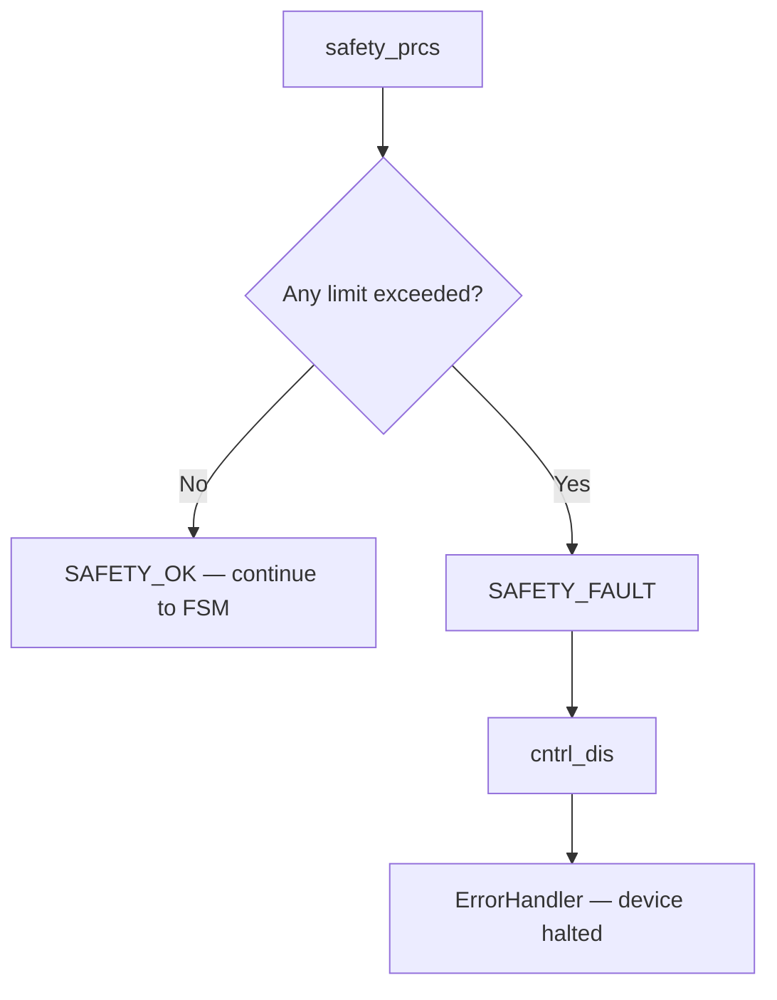
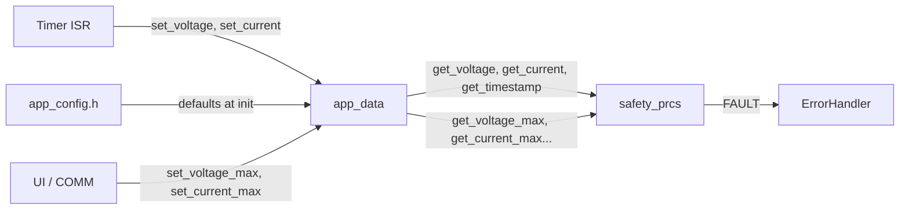

# Safety Module

---

1. Overview
2. Monitored Parameters
3. Fault Behavior
4. API
5. Integration with FSM
6. Data Flow
7. Configuration
8. Dependencies
9. Limitations / TODO

---

## 1. Overview

Continuous monitoring of electrical and thermal parameters.
Called **before** FSM in `app_runtime()` — fault detection is independent of application state.
Any fault is critical and results in `ErrorHandler()` (device halt, power cycle required).

## 2. Monitored Parameters

| Parameter | Fault Condition | Default Limit | Source | Runtime Overridable |
| :--- | :--- | :--- | :--- | :---: |
| Overvoltage | `voltage >= voltage_max` | 15000 mV | `app_data` | ✅ |
| Undervoltage | `voltage < voltage_min` | 10500 mV | `app_data` | ✅ |
| Overcurrent | `current >= current_max` | 15000 mA | `app_data` | ✅ |
| Overpower | `V × I / 1000 >= power_max` | 100000 mW | `app_data` | ✅ |
| Overtemperature | `temp > SAFETY_TEMP_MAX` | TBD | `app_config.h` | ❌ |
| Stale measurement | `tick - timestamp > SAFETY_MEAS_TIMEOUT` | 500 ms | `app_config.h` | ❌ |

## 3. Fault Behavior



- All faults are **critical** — no recovery in POC
- `ErrorHandler()` is a dead end (`while(1)`), requires power cycle
- No distinction between fault types (future: logging which fault triggered)

## 4. API

| Function | Description |
| :--- | :--- |
| `safety_init()` | Sets status to `SAFETY_OK` |
| `safety_deinit()` | Empty — no resources to release |
| `safety_prcs()` | Checks all parameters, calls `ErrorHandler()` on fault |
| `safety_rst()` | Reserved for future recovery (currently unused in POC) |
| `safety_get_status()` | Returns `SAFETY_OK` or `SAFETY_FAULT` |

## 5. Integration with FSM

```c
void app_runtime(void) {
    safety_prcs();              // ALWAYS first — before FSM
    // if fault → ErrorHandler(), never reaches FSM

    switch (s_state) {          // FSM runs only if safety OK
        case APP_ST_IDLE: ...
        case APP_ST_RUN:  ...
    }
}
```

Safety fires in **every state** — current detected while device is in `IDLE` → fault.

## 6. Data Flow



## 7. Configuration

Default limits defined in `app_config.h`:

```c
#define SAFETY_VOLTAGE_MAX     15000   // mV
#define SAFETY_VOLTAGE_MIN     10500   // mV
#define SAFETY_CURRENT_MAX     15000   // mA
#define SAFETY_POWER_MAX       100000  // mW
#define SAFETY_TEMP_MAX        85      // °C
#define SAFETY_MEAS_TIMEOUT    500     // ms
```

Overridable limits are loaded into `app_data` at `app_data_init()` and can be changed at runtime via `app_data_set_*()` (from UI or COMM).

## 8. Dependencies

```
app_config.h   ← #define defaults and hardcoded limits
     ↓
app_data       ← current values (measurements + limits)
     ↓
safety         ← reads ONLY from app_data + app_config
```

Safety does **not** include or depend on any other module (control, ui, comm).

## 9. Limitations / TODO

- No logging of which specific fault triggered — all go to `ErrorHandler()`
- Temperature sensor not connected — `app_data_get_temp_int()` always returns 0 (potential false negative)
- No recovery mechanism — POC uses `ErrorHandler()` as dead end
- Future: fault latch + `APP_ST_ERR` + `safety_rst()` for graceful recovery